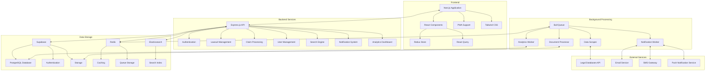

```mermaid
graph TD
    subgraph "Frontend"
        A[Next.js Application] --> B[React Components]
        B --> C[Redux Store]
        B --> D[React Query]
        A --> E[PWA Support]
        A --> F[Tailwind CSS]
    end
    
    subgraph "Backend Services"
        G[Express.js API] --> H[Authentication]
        G --> I[Lawsuit Management]
        G --> J[Claim Processing]
        G --> K[User Management]
        G --> L[Search Engine]
        G --> M[Notification System]
        G --> N[Analytics Dashboard]
    end
    
    subgraph "Background Processing"
        O[Bull Queue] --> P[Data Scraper]
        O --> Q[Notification Worker]
        O --> R[Document Processor]
        O --> S[Analytics Worker]
    end
    
    subgraph "Data Storage"
        T[Supabase] --> U[PostgreSQL Database]
        T --> V[Authentication]
        T --> W[Storage]
        X[Redis] --> Y[Caching]
        X --> Z[Queue Storage]
        AA[Elasticsearch] --> AB[Search Index]
    end
    
    subgraph "External Services"
        AC[Legal Databases API]
        AD[Email Service]
        AE[SMS Gateway]
        AF[Push Notification Service]
    end
    
    A <--> G
    G <--> T
    G <--> X
    G <--> AA
    O <--> X
    P <--> AC
    Q <--> AD
    Q <--> AE
    Q <--> AF
    R <--> W
    S <--> U
```
